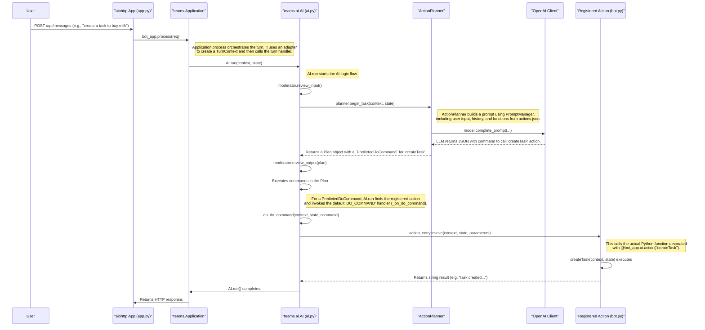
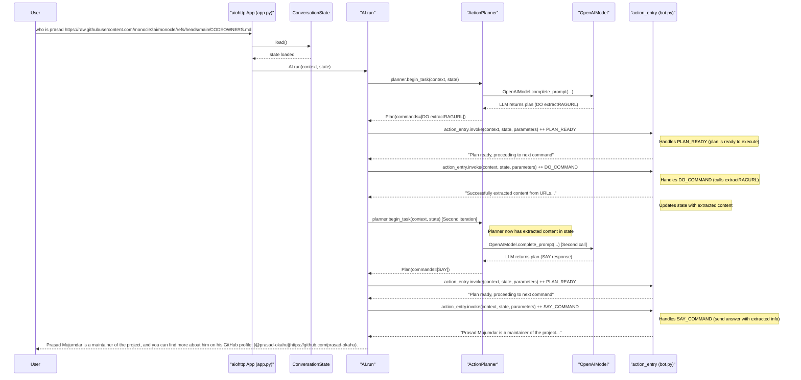
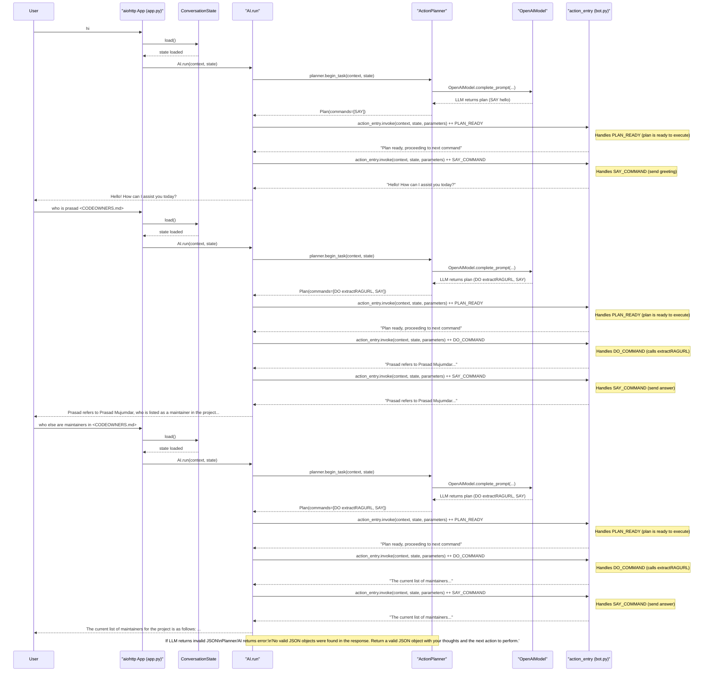

# Teams AI Support

## Table of Contents

1. [Code Flow](#code-flow)
   - [Flow Breakdown](#flow-breakdown)
2. [Instrumentation Requirements](#instrumentation-requirements)
   - [Basic Custom Engine Agent (Typescript)](#1-basic-custom-engine-agent-typescript)
   - [Basic Bot](#2-basic-bot)
   - [Agent with API Build from Scratch](#3-agent-with-api-build-from-scratch)
   - [AI Bot with Azure AI Search](#4-ai-bot-with-azure-ai-search)
3. [Categorization of Inference Span](#categorization-of-inference-span)

## Overview

Versions to understand where we are:

- Python: monocle_apptrace v0.4.0

- Typescript: Monocle v0.2.0-beta.1

The goal of this document is to identify the gaps for each of Teams AI app samples to cover the instrumentation gaps in the Teams AI SDK.

Sample Apps Source: https://github.com/OfficeDev/microsoft-365-agents-toolkit/tree/main/templates

## Code Flow

> We will use [Agent with API Build from Scratch](https://github.com/OfficeDev/microsoft-365-agents-toolkit/tree/main/templates/python/custom-copilot-assistant-new) bot for all flow diagrams below. They are mostly similar except the usage of `ActionPlanner` SDK.

This diagram illustrates the code flow from a user sending a chat message in Teams to a specific action handler, like `createTask`, being executed within the bot.



### Flow Breakdown

1.  **Request Entry**: The user's message is sent to the `/api/messages` endpoint in `src/app.py`.
2.  **Application Processing**: `bot_app.process(req)` is called. The `teams.Application` instance, using `TeamsAdapter`, converts the incoming HTTP request into a `TurnContext` object, which encapsulates all the information about the turn.
3.  **AI System Execution**: The application routes the `TurnContext` to the AI system by calling `AI.run(context, state)`.
4.  **Input Moderation**: The AI system's `Moderator` first reviews the user's input for any policy violations (See [Moderator](https://github.com/microsoft/teams-ai/blob/main/getting-started/CONCEPTS/MODERATOR.md)).
5.  **Planning**: `ActionPlanner.begin_task` is invoked.
    *   It uses the `PromptManager` to construct a detailed prompt. This prompt includes the overall instructions (`skprompt.txt`), the user's current message, conversation history, and the list of available tools/actions (`actions.json`).
    *   The `OpenAIModel` sends this prompt to the configured LLM.
    *   The LLM analyzes the prompt and decides that the `createTask` action should be executed. It returns a response, typically structured as JSON, indicating the action name and parameters (e.g., `{"action": "createTask", "parameters": {"title": "buy milk", "description": "get some milk from the store"}}`).
    *   The `ActionPlanner` parses this response and creates a `Plan` object containing a `PredictedDoCommand`.
6.  **Output Moderation**: The generated `Plan` is reviewed by the `Moderator` before execution.
7.  **Plan Execution**: The `AI.run` method iterates through the commands in the `Plan`.
8.  **Action Dispatch**:
    *   For a `PredictedDoCommand`, `AI.run` calls its internal `_on_do_command` handler.
    *   `_on_do_command` looks up the action name (`createTask`) in its registry of actions.
    *   It finds the `ActionEntry` corresponding to `createTask` and calls its `invoke` method, passing the context, state, and the parameters from the plan.
9.  **Action Handler Execution**: The `invoke` call finally executes the Python function registered for the action, i.e., the `create_task` function in `src/bot.py`. This function contains the business logic to create the task and update the application state.
10. **Response**: The action returns a string, the AI loop may continue or end, and eventually, an HTTP response is sent back.

## Instrumentation Requirements

### 1. Basic Custom Engine Agent (Typescript)

#### Current State

**Spans**: 
- workflow


**Traces**: [Basic-Custom-Engine-Agent.json](../resources/Basic-Custom-Engine-Agent.json)

> This `workflow` is not useful for users because it doesn't show the details of the steps.

#### Requirements

At the minimum, this needs to be on-pair with Python version:

- `aiohttp.web_app.Application`
- `teams.ai.planners.action_planner.ActionPlanner`
- `teams.ai.models.openai_model.OpenAIModel`
- `openai.resources.chat.completions.completions.AsyncCompletions`

### 2. Basic Bot

#### Current State

**Spans**: 
- `workflow`
- `aiohttp.web_app.Application`
- `teams.ai.planners.action_planner.ActionPlanner`
- `teams.ai.models.openai_model.OpenAIModel`
- `openai.resources.chat.completions.completions.AsyncCompletions`


**Traces**: [Basic-Bot.json](../resources/Basic-Bot.json)

#### Requirements

- `teams.ai.prompts.prompt_manager.PromptManager` - We need to understand better how PromptManager transforms the prompt using variables.


### 3. Agent with API Build from Scratch

#### Current State

**Spans**:
- `workflow`
- `aiohttp.web_app.Application`
- `teams.ai.planners.action_planner.ActionPlanner`
- `teams.ai.models.openai_model.OpenAIModel`
- `openai.resources.chat.completions.completions.AsyncCompletions`


**Traces (without new instrumentation)**: [Agent-with-API-Build-from-Scratch.json](../resources/Agent-with-API-Build-from-Scratch.json)

#### Requirements (UPDATED 7/8 for 0.4.1a9)

The goal of this instrumentation:
1.  **[Optional]** Trace the complete lifecycle of a user request, from the initial HTTP call to the final action execution. The caveat is that this might apply to lots of aiohttp requests as well (which will cause a large number of traces).
2.  Gain visibility into the AI planner's decision-making process, including which actions and parameters are chosen.
3.  Monitor the performance and correctness of individual, custom-defined actions (the "API" part).
4.  Debug prompt engineering by inspecting the exact prompts sent to the LLM.
5.  **[Optional]** Understand the impact of content moderation on both user inputs and AI outputs. This is applicable to all bots using Teams AI SDK but most will rely on the LLM outputs to determine.

To gain deeper insights into the application's behavior, performance, and potential issues, we recommend instrumenting the following classes and methods. This complements the existing instrumentations on `aiohttp`, `ActionPlanner`, `OpenAIModel`, and `openai`.

> Note: The exact "method" may need to be verified. This is due to the use of Template Method Pattern in Teams AI SDK.
>
> For example, the Moderator's review_output() is defined in various files:
>
> ```python
> # Base abstract class (interface)
> class Moderator(ABC):
> @abstractmethod
> async def review_output(self): pass
>
> # Concrete implementations
> class DefaultModerator(Moderator):
> async def review_output(self):
> return plan # Simple pass-through
>
> class OpenAIModerator(Moderator):
> async def review_output(self):
> # Complex OpenAI moderation logic
>
> class AzureContentSafetyModerator(Moderator):
> async def review_output(self):
> # Complex Azure moderation logic
> ```
>
> The method exists everywhere because:
> - Moderator (base class) defines it as an abstract method that all moderators must implement
> - Each concrete moderator class (`DefaultModerator`, `OpenAIModerator`, `AzureContentSafetyModerator`) provides its own implementation:
> - `DefaultModerator`: Simple pass-through, no moderation
> - `OpenAIModerator`: Uses OpenAI's moderation API
> - `AzureContentSafetyModerator`: Uses Azure Content Safety API
>
> This pattern allows the Teams AI framework to:
> - Use any moderator interchangeably (polymorphism)
> - Ensure all moderators have the required methods
> - Let each moderator implement its own moderation logic while maintaining a consistent interface

| Class/Method & Reason | Status | Details | Inputs to Capture | Outputs to Capture |
|----------------------|--------|---------|-------------------|-------------------|
| `teams.app.Application.process`<br/>To trace the entire processing of an incoming request, providing a top-level view of a single turn. | ✅ **Implemented** | Span name: `teams.app.application.process`<br/>Span type: `application` | `aiohttp.web.Request` object containing headers and body. | `aiohttp.web.Response` object. |
| `teams.ai.ai.AI.run`<br/>This is the main entry point for the AI logic. Instrumenting it allows seeing the entire AI chain of thought process for a turn. | ✅ **Implemented** | Span name: `teams.ai.ai.AI.run`<br/>Span type: `application` | `context: TurnContext`, `state: TurnState`. Can capture `context.activity.text` for user input. | Boolean for success. The final state, or any exceptions raised. |
| `teams.ai.actions.ActionEntry.invoke`<br/>To monitor the execution of individual actions predicted by the planner. Crucial for debugging action calls, parameters, and success/failure. | ✅ **Implemented** | Span name: `teams.ai.actions.action_entry.invoke`<br/>Span type: `state_management` | `context: TurnContext`, `state: TurnState`, `parameters` for the action, `name` of the action. | The string result returned by the action handler. |
| `teams.ai.moderators.moderator.Moderator.review_input`<br/>To monitor input content moderation and understand if/why user input is being flagged. | ❌ **Not Implemented** | - | `context: TurnContext`, `state: TurnState`. Can capture `context.activity.text`. | **[P1]** A `Plan` object if the input is flagged (containing a `FLAGGED_INPUT` action), otherwise `None`. |
| `teams.ai.moderators.moderator.Moderator.review_output`<br/>To monitor output content moderation and understand if/why the bot's generated response/plan is being flagged. | ❌ **Not Implemented** | - | `context: TurnContext`, `state: TurnState`, `plan: Plan`. | **[P1]** The (potentially modified) `Plan` object. |
| `src.state.AppTurnState.load`<br/>To monitor the performance of loading application state from storage, helping identify state-related performance bottlenecks. | ✅ **Implemented** | Span name: `app.state.conversation_state.load`<br/>Span type: `state_management` | `context: TurnContext`, `storage: Storage`. | The loaded `AppTurnState` object. Its size could be captured. |
| `teams.state.conversation_state.ConversationState.load`<br/>To monitor base conversation state loading from storage. | ✅ **Implemented** | Span name: `teams.state.conversation_state.load`<br/>Span type: `state_management` | `context: TurnContext`, `storage: Storage`. | The loaded `ConversationState` object. Its size could be captured. |
| `teams.ai.prompts.prompt_manager.PromptManager.get_prompt`<br/>To inspect prompt templates and configurations being retrieved from the prompt manager. | ✅ **Implemented** | Span name: `teams.ai.prompts.prompt_manager.get_prompt`<br/>Span type: `prompt_manager` | `prompt_name` (e.g., "planner"). | `prompt_template`, `prompt_template_config`, `prompt_template_actions`. |
| `teams.ai.prompts.prompt_manager.PromptManager.render_prompt`<br/>To inspect the exact prompt being sent to the LLM. This is invaluable for debugging prompt engineering and improving model responses. | ❌ **Not Implemented** | - | `context: TurnContext`, `state: TurnState`, `prompt` name or template. | **[P1]** The rendered prompt string or list of messages. `prompt_manager.get_prompt` seems to retrieve the same values so defer for now.|

#### Pending Implementation & Flow

##### 1-Chat Conversation

**Sample Trace**: [Teams-ai-basic-rag-bot-prompt-manager1.json](../resources/Teams-ai-basic-rag-bot-prompt-manager1.json)

**Flow explained in plain English:**

1. **User Input**: "who is prasad https://raw.githubusercontent.com/monocle2ai/monocle/refs/heads/main/CODEOWNERS.md"

2. **First OpenAIModel Call**: 
   - **Prompt**: System instructions + user message + available actions (`createTask`, `deleteTask`, `extractRAGURL`, `SAY`)
   - **What affects the prompt**: User's question + URL + available action definitions
   - **LLM Decision**: "I need to extract the URL to find information about Prasad" → Plan: `DO` `extractRAGURL`

3. **extractRAGURL Action**: Fetches and stores the `CODEOWNERS.md` content in conversation state

4. **Second OpenAIModel Call**:
   - **Prompt**: System instructions + user message + **extracted content** (now includes the maintainers list) + available actions
   - **What affects the prompt**: User's question + **extracted content showing Prasad is a maintainer** + available action definitions
   - **LLM Decision**: "I found Prasad in the maintainers list" → Plan: `SAY` response

5. **SAY Command**: Sends final response to user

6. **Bot Output**: "Prasad Mujumdar is a maintainer of the project, and you can find more about him on his GitHub profile: @prasad-okahu."

**Key Insight**: The **extracted content** from the first action becomes part of the **second prompt**, enabling the LLM to provide an informed response based on the actual data from the URL.

**Technical Flow:**

1. **User**: Asks "who is prasad https://raw.githubusercontent.com/monocle2ai/monocle/refs/heads/main/CODEOWNERS.md"

2. **WebApp**: Receives the HTTP request and routes it to the Teams AI application

3. **ConversationState**: Loads the current conversation state from storage, including any previous context and extracted content

4. **AI.run**: Starts the AI processing pipeline for this user turn

5. **ActionPlanner**: Analyzes the user's request and determines what actions are needed

6. **OpenAIModel**: Receives the prompt and generates a plan to extract information from the provided URL

7. **ActionPlanner**: Creates a plan with the command `DO extractRAGURL` to fetch content from the GitHub URL

8. **AI.run**: Executes the plan, starting with `PLAN_READY` to indicate the plan is ready for execution

9. **ActionEntry**: Handles the `DO_COMMAND` by calling the `extractRAGURL` function, which fetches the content from the GitHub URL

10. **ActionEntry**: Updates the conversation state with the extracted content (the CODEOWNERS.md file showing maintainers)

11. **ActionPlanner**: Re-plans with the new context (now has the extracted content about maintainers)

12. **OpenAIModel**: Receives the updated prompt (now including the extracted content) and generates a plan to respond to the user

13. **ActionPlanner**: Creates a new plan with the command `SAY` to send a response to the user

14. **AI.run**: Executes the new plan, starting with `PLAN_READY` for the `SAY` command

15. **ActionEntry**: Handles the `SAY_COMMAND` by formatting the response using the extracted information about Prasad

16. **AI.run**: Returns the final response to the user

17. **User**: Receives the answer: "Prasad Mujumdar is a maintainer of the project, and you can find more about him on his GitHub profile: @prasad-okahu."



##### 3-Chat Conversation

**Sample Trace**: 

- [Teams-ai-basic-rag-bot-3-chat.json](../resources/Teams-ai-basic-rag-bot-3-chat.json)

- [Teams-ai-basic-rag-bot-prompt-manager2.json](../resources/Teams-ai-basic-rag-bot-prompt-manager2.json)

**Key Points:**

1. **First Message ("hi")**: No function calls needed - direct `SAY` response
2. **Second Message**: Calls `extractRAGURL` to fetch content, then `SAY` response  
3. **Third Message**: Calls `extractRAGURL` again (demonstrates conversation_state persistence across messages)

**Demonstrates**: How conversation_state maintains context and extracted content across multiple user interactions.



### 4. AI Bot with Azure AI Search

#### Current State

**Spans**:
- `workflow`
- `aiohttp.web_app.Application`
- `teams.ai.planners.action_planner.ActionPlanner`
- `teams.ai.models.openai_model.OpenAIModel`
- `openai.resources.chat.completions.completions.AsyncCompletions`


## Categorization of Inference Span

### Assumptions
Every AI action that involves prompting has a root inference. Our goal is to identify the task that each inference is performing, so we can provide clear, meaningful categories for users to focus on specific types of inference.

- **Search and Filtering:**  
  Instead of searching by span ID (which is not meaningful), users should be able to search and filter by span type or category.  
  Visualizations (e.g., Gantt charts) should group by inference type or relevant entities, not just function names.

- **Useful Categories:**  
  - What categories of inference are most useful?
  - What information is most valuable to know for each category?

- **Assignment of Categories:**  
  - Some inferences can be deterministically categorized (e.g., refusal, blocked).
  - Others may be suggested but not definitive (input for future model-based categorization).
  - Some may remain unknown.

- **User Interaction and Insights:**  
  - How can users interact with insights, architecture, traces, and prompts to easily access these categories?
  - Use tests (e.g., blocked or not, deterministic refusals).
  - Use evaluations (e.g., is this a jailbreak? Some uncertainty is inevitable).
  - Allow users to edit or refine the categorization after the fact.

### Methodology for Deterministic Approach

1. **Instrument the ActionPlanner’s `continue_task`:**
   ```python
   async def continue_task(self, context: TurnContext, state: TurnState) -> Plan:
   ```
2. **Plan Analysis:**  
   The `continue_task` method provides the commands in the plan (not necessarily the output of the command):
   ```python
   PredictedCommand = Union[PredictedDoCommand, PredictedSayCommand]
   ```

3. **Inference Type:**  Inteference span will inherit the category from the parent. From the plan, determine if the inference is orchestrating the next task or communicating via a final `SAY` command. We will start with three scenarios:

   - `DO`: inteference span category = "`routing`"
   - `SAY`: inteference span category = "`communication`"
   - `DO` & `Data Source`: inteference span category = "`retrieval`"

4. **Trace UX:**  
   In the traces UI, the ActionPlanner will have a new parent span called `continue_task` with attributes describing the `Plan`.

### Methodology for Non-deterministic Approach

There are some options:

1. **String Match:** `grep` the exact string or perform `regex` in the prompt and response to do a best guess that the interence is performing a specific function. For example: Check if the prompt input has `skprompt.txt` and ends with `actions.json` content.

   - **Pros**: If done right, this could be very accurate on categorization.
   - **Cons**: It will take some effort to "index" all possible strings to check against per framework (LlamaIndex, Langchain, Teams AI ASK, Azure AI SDK, etc...).

2. **Categorization eval:** Submit the entire prompt and response (plus optional of the Teams AI SDK and App Codebase) to an LLM to evaluate or classify the interence into specific list of categories.

   - **Pros**: Relatively easy to build a generic process for all frameworks.
   - **Cons**: The results could be random so for the most part, we have to do a very good job at prompt engineering.