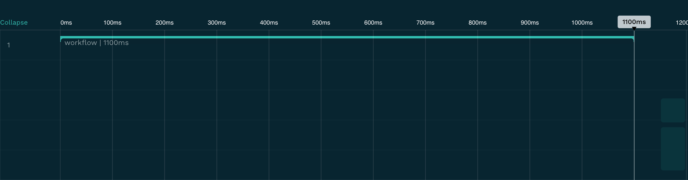
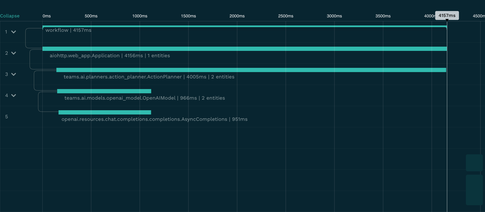
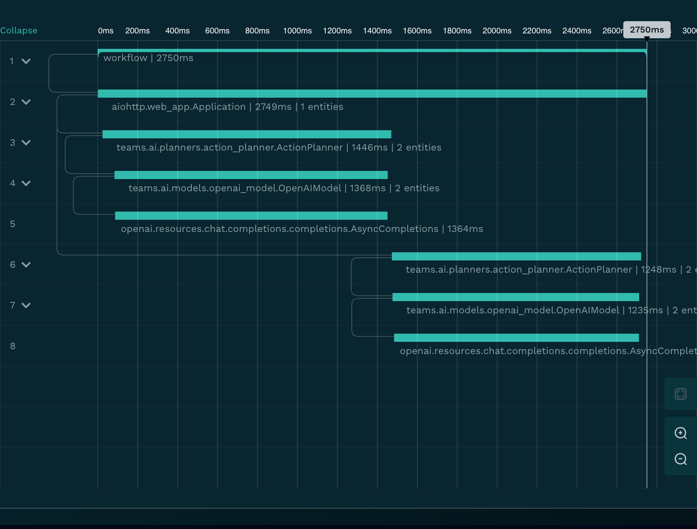
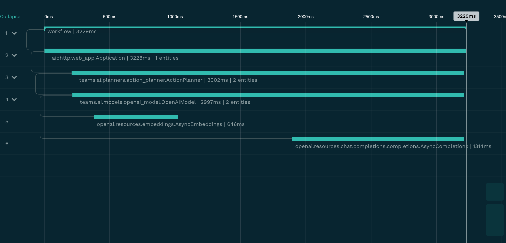
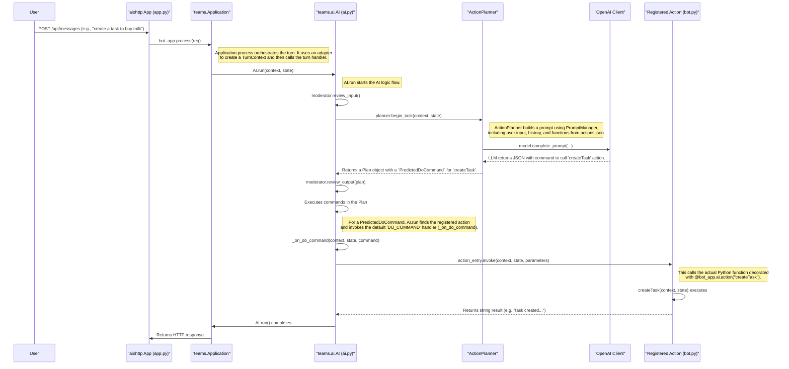
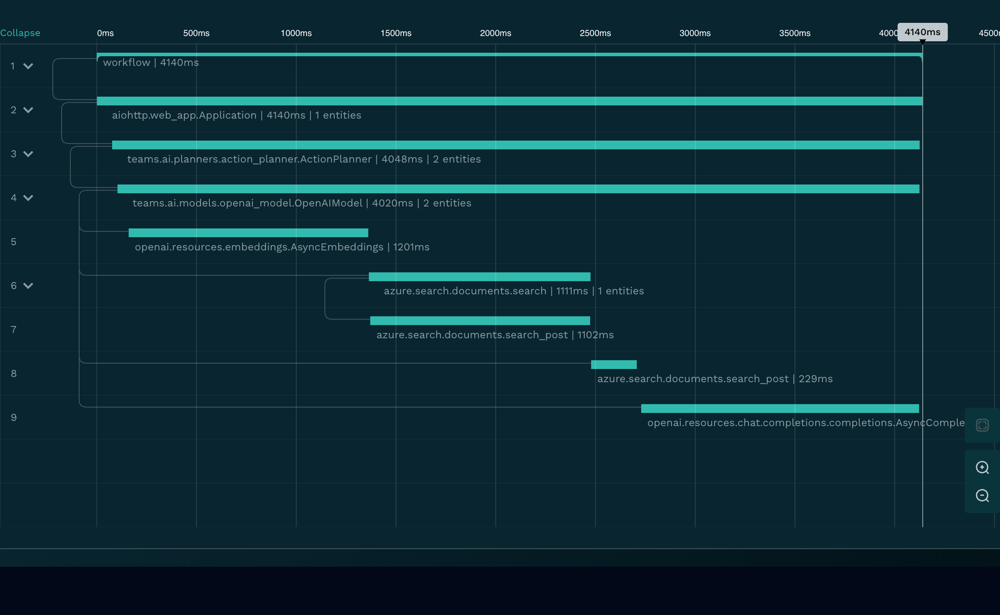

# Teams AI Support
## What's Supported

- Python: monocle_apptrace v0.4.0

- Typescript: Monocle v0.2.0-beta.1

## Summary of Instrumented Methods

### 1. Basic Custom Engine Agent (Typescript)

**Spans**: 
- workflow



**Traces**: [Basic-Custom-Engine-Agent.json](../resources/Basic-Custom-Engine-Agent.json)

> This `workflow` is not useful for users because it doesn't show the details of the steps.

### 2. Basic Bot

**Spans**: 
- `workflow`
- `aiohttp.web_app.Application`
- `teams.ai.planners.action_planner.ActionPlanner`
- `teams.ai.models.openai_model.OpenAIModel`
- `openai.resources.chat.completions.completions.AsyncCompletions`



**Traces**: [Basic-Bot.json](../resources/Basic-Bot.json)

### 3. Agent with API Build from Scratch

**Spans**:
- `workflow`
- `aiohttp.web_app.Application`
- `teams.ai.planners.action_planner.ActionPlanner`
- `teams.ai.models.openai_model.OpenAIModel`
- `openai.resources.chat.completions.completions.AsyncCompletions`



**Traces**: [Agent-with-API-Build-from-Scratch.json](../resources/Agent-with-API-Build-from-Scratch.json)


### 4. AI Bot with Azure AI Search

**Spans**:
- `workflow`
- `aiohttp.web_app.Application`
- `teams.ai.planners.action_planner.ActionPlanner`
- `teams.ai.models.openai_model.OpenAIModel`
- `openai.resources.chat.completions.completions.AsyncCompletions`
- `openai.resources.embeddings.AsyncEmbeddings`




**Traces**: [AI-Bot-with-Azure-AI-Search.json](../resources/AI-Bot-with-Azure-AI-Search.
json)


## Code Flow

> We will use `Agent with API Build from Scratch` bot for all diagram flow below. They are mostly similar except the usage of `ActionPlanner` SDK.

This diagram illustrates the code flow from a user sending a chat message in Teams to a specific action handler, like `createTask`, being executed within the bot.



### Flow Breakdown

1.  **Request Entry**: The user's message is sent to the `/api/messages` endpoint in `src/app.py`.
2.  **Application Processing**: `bot_app.process(req)` is called. The `teams.Application` instance, using `TeamsAdapter`, converts the incoming HTTP request into a `TurnContext` object, which encapsulates all the information about the turn.
3.  **AI System Execution**: The application routes the `TurnContext` to the AI system by calling `AI.run(context, state)`.
4.  **Input Moderation**: The AI system's `Moderator` first reviews the user's input for any policy violations (See [Moderator](https://github.com/microsoft/teams-ai/blob/main/getting-started/CONCEPTS/MODERATOR.md)).
5.  **Planning**: `ActionPlanner.begin_task` is invoked.
    *   It uses the `PromptManager` to construct a detailed prompt. This prompt includes the overall instructions (`skprompt.txt`), the user's current message, conversation history, and the list of available tools/actions (`actions.json`).
    *   The `OpenAIModel` sends this prompt to the configured LLM.
    *   The LLM analyzes the prompt and decides that the `createTask` action should be executed. It returns a response, typically structured as JSON, indicating the action name and parameters (e.g., `{"action": "createTask", "parameters": {"title": "buy milk", "description": "get some milk from the store"}}`).
    *   The `ActionPlanner` parses this response and creates a `Plan` object containing a `PredictedDoCommand`.
6.  **Output Moderation**: The generated `Plan` is reviewed by the `Moderator` before execution.
7.  **Plan Execution**: The `AI.run` method iterates through the commands in the `Plan`.
8.  **Action Dispatch**:
    *   For a `PredictedDoCommand`, `AI.run` calls its internal `_on_do_command` handler.
    *   `_on_do_command` looks up the action name (`createTask`) in its registry of actions.
    *   It finds the `ActionEntry` corresponding to `createTask` and calls its `invoke` method, passing the context, state, and the parameters from the plan.
9.  **Action Handler Execution**: The `invoke` call finally executes the Python function registered for the action, i.e., the `create_task` function in `src/bot.py`. This function contains the business logic to create the task and update the application state.
10. **Response**: The action returns a string, the AI loop may continue or end, and eventually, an HTTP response is sent back.

## Instrumentation Recommendations

### 1. Basic Custom Engine Agent (Typescript)

### 2. Basic Bot


### 3. Agent with API Build from Scratch

To gain deeper insights into the application's behavior, performance, and potential issues, we recommend instrumenting the following classes and methods. This complements the existing instrumentations on `aiohttp`, `ActionPlanner`, `OpenAIModel`, and `openai`.

> Note: The exact "method" may need to be verified. This is due to the use of Template Method Pattern in Teams AI SDK.
>
> For example, the Moderator's review_output() is defined in various files:
>
> ```python
> # Base abstract class (interface)
> class Moderator(ABC):
> @abstractmethod
> async def review_output(self): pass
>
> # Concrete implementations
> class DefaultModerator(Moderator):
> async def review_output(self):
> return plan # Simple pass-through
>
> class OpenAIModerator(Moderator):
> async def review_output(self):
> # Complex OpenAI moderation logic
>
> class AzureContentSafetyModerator(Moderator):
> async def review_output(self):
> # Complex Azure moderation logic
> ```
>
> The method exists everywhere because:
> - Moderator (base class) defines it as an abstract method that all moderators must implement
> - Each concrete moderator class (`DefaultModerator`, `OpenAIModerator`, `AzureContentSafetyModerator`) provides its own implementation:
> - `DefaultModerator`: Simple pass-through, no moderation
> - `OpenAIModerator`: Uses OpenAI's moderation API
> - `AzureContentSafetyModerator`: Uses Azure Content Safety API
>
> This pattern allows the Teams AI framework to:
> - Use any moderator interchangeably (polymorphism)
> - Ensure all moderators have the required methods
> - Let each moderator implement its own moderation logic while maintaining a consistent interface

| Class/Method                                              | Reason                                                                                                                                              | Inputs to Capture                                                                                          | Outputs to Capture                                                                                                     |
| --------------------------------------------------------- | --------------------------------------------------------------------------------------------------------------------------------------------------- | ------------------------------------------------------------------------------------------------------------------ | ---------------------------------------------------------------------------------------------------------------------- |
| `teams.app.Application.process`                           | To trace the entire processing of an incoming request, providing a top-level view of a single turn.                                                 | `aiohttp.web.Request` object containing headers and body.                                                          | `aiohttp.web.Response` object.                                                                                         |
| `teams.ai.ai.AI.run`                                      | This is the main entry point for the AI logic. Instrumenting it allows seeing the entire AI chain of thought process for a turn.                     | `context: TurnContext`, `state: TurnState`. Can capture `context.activity.text` for user input.                  | Boolean for success. The final state, or any exceptions raised.                                                        |
| `teams.ai.actions.ActionEntry.invoke`                     | To monitor the execution of individual actions predicted by the planner. Crucial for debugging action calls, parameters, and success/failure.           | `context: TurnContext`, `state: TurnState`, `parameters` for the action, `name` of the action.                    | The string result returned by the action handler.                                                                      |
| `teams.ai.moderators.moderator.Moderator.review_input`    | To monitor input content moderation and understand if/why user input is being flagged.                                                              | `context: TurnContext`, `state: TurnState`. Can capture `context.activity.text`.                                 | A `Plan` object if the input is flagged (containing a `FLAGGED_INPUT` action), otherwise `None`.                       |
| `teams.ai.moderators.moderator.Moderator.review_output`   | To monitor output content moderation and understand if/why the bot's generated response/plan is being flagged.                                        | `context: TurnContext`, `state: TurnState`, `plan: Plan`.                                                          | The (potentially modified) `Plan` object.                                                                              |
| `src.state.AppTurnState.load`                             | To monitor the performance of loading application state from storage, helping identify state-related performance bottlenecks.                         | `context: TurnContext`, `storage: Storage`.                                                                        | The loaded `AppTurnState` object. Its size could be captured.                                                          |
| `teams.ai.prompts.prompt_manager.PromptManager.render_prompt` | To inspect the exact prompt being sent to the LLM. This is invaluable for debugging prompt engineering and improving model responses.             | `context: TurnContext`, `state: TurnState`, `prompt` name or template.                                           | The rendered prompt string or list of messages.                                                                        |

### 4. AI Bot with Azure AI Search

The Azure AI Search bot extends the basic Teams AI bot with search capabilities. Here's how the flow works:

1.  **Initial Request Flow**: Same as basic bot until reaching the planner.
2.  **Search Integration Points**:
    *   When user asks a question, the bot first converts it to embeddings using `openai.resources.embeddings.AsyncEmbeddings`.
    *   These embeddings are used to perform vector search in Azure AI Search.
    *   Search results are incorporated into the prompt before calling the LLM.
    *   The LLM then generates a response based on both the search results and the conversation context.

> **Note**: Azure Search instrumentation requires both client and post-processing due to data availability (*This assumption needs validation*):
> *   `azure.search.documents.search`: Captures the initial search request but may lack complete result details.
> *   `azure.search.documents.search_post`: Captures full search results including scores and reranking.
>
> ```python
> # Example of what client vs post capture:
> # Client capture - Basic request info
> {
>     "vector_queries": [{"fields": "vector", "k": 3}],
>     "select": "docTitle,content"
> }
> 
> # Post capture - Detailed results
> {
>     "results": [
>         {
>             "docTitle": "Document 1",
>             "description": "Content...",
>             "@search.score": 0.89,
>             "@search.reranker_score": 0.92
>         }
>     ]
> }
> ```

#### Additional Classes to Instrument

| Class/Method | Reason | Inputs to Capture | Outputs to Capture |
|---|---|---|---|
| `azure.search.documents.SearchClient.search` ([Instrumentation](../resources/azure_search_client_processor.py)) | Monitor raw search requests and performance. Captures the query sent to Azure Search before post-processing. | `kwargs`: `search_text`, `vector_queries` (without vector data), `filter`, `select`, `top`, `skip` | `pager`: `get_count()`, `get_coverage()`, `get_facets()` |
| `azure.search.documents.SearchClient.search_post` ([Instrumentation](../resources/azure_search_post_processor.py)) | Capture detailed search results with scores after post-processing. Essential for visibility into reranking and final document scores. | `search_request`: `search_text` and other options like `scoring_profile`, `semantic_query`. | `results`: List of documents with `docTitle`, `description`, `@search.score`, `@search.reranker_score`. |
| `teams.ai.prompts.prompt_manager.PromptManager.render_prompt` | Debug how search results are incorporated into the final prompt sent to the LLM. | `state`: `temp.data_sources` which contains the search results. `prompt`: The prompt template object. | The fully rendered `PromptTemplate` object, including the text with citations from search results. |
| `teams.ai.citations.citations.format_citations_response` | Monitor citation formatting. Useful for debugging cases where citations are missing or incorrect in the final response. | `content`: The raw response string from the LLM. `citations`: List of `ClientCitation` objects. | The formatted response string with citation markers (e.g., `[doc1]`). |

**New Instrumented Traces**: [AI-Bot-with-Azure-AI-Search-Instrumented.json](../resources/AI-Bot-with-Azure-AI-Search-Instrumented.json) (Sample with full search instrumentation)



The instrumentation should focus on:
1.  Search performance metrics (latency, result counts)
2.  Search quality indicators (scores, reranking)
3.  Prompt construction with search results
4.  Citation handling and formatting