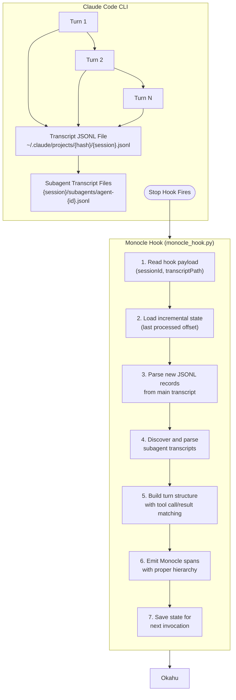
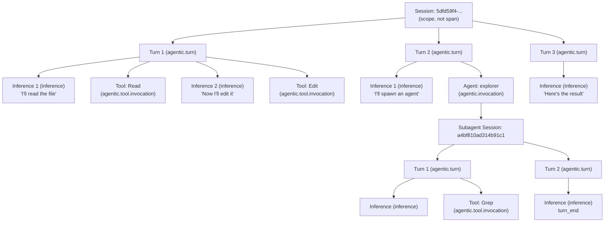

# Monocle Claude Code Hook - Design Document

## Table of Contents

- [1. What Do We Want Answered by Instrumenting Claude CLI?](#1-what-do-we-want-answered-by-instrumenting-claude-cli)
  - [1.1 Model Selection & Switching](#11-model-selection--switching)
  - [1.2 Developer Productivity & Knowledge Transfer](#12-developer-productivity--knowledge-transfer)
  - [1.3 Skills & Tools Effectiveness](#13-skills--tools-effectiveness)
  - [1.4 MCP Server Usage](#14-mcp-server-usage)
  - [1.5 Testing & Quality](#15-testing--quality)
  - [1.6 Cost & Efficiency](#16-cost--efficiency)
  - [1.7 Organizational Patterns](#17-organizational-patterns)
  - [1.8 Defining Success](#18-defining-success)
- [2. Overview](#2-overview)
  - [2.1 Goals](#21-goals)
  - [2.2 Non-Goals](#22-non-goals)
- [3. Claude Code Hook System](#3-claude-code-hook-system)
  - [3.1 Available Hooks](#31-available-hooks)
  - [3.2 Hook Payload (Stop)](#32-hook-payload-stop)
  - [3.3 Configuration](#33-configuration)
- [4. Transcript File Structure](#4-transcript-file-structure)
  - [4.1 Locations](#41-locations)
  - [4.2 JSONL Record Types](#42-jsonl-record-types)
- [5. Monocle Span Mapping](#5-monocle-span-mapping)
  - [5.1 Transcript JSON to Monocle Span Mapping](#51-transcript-json-to-monocle-span-mapping)
  - [5.2 Tool Classification Logic](#52-tool-classification-logic)
  - [5.3 JSON-to-Span ID Linkage](#53-json-to-span-id-linkage)
- [6. Real Example: JSONL to Spans](#6-real-example-jsonl-to-spans)
  - [6.1 Source JSONL Lines (Round 1)](#61-source-jsonl-lines-round-1-msg_01nusabygsi6hgenpY8wumMw)
  - [6.2 How build_turns Merges Streaming Snapshots](#62-how-build_turns-merges-streaming-snapshots)
  - [6.3 3 Spans Produced](#63-3-spans-produced)
  - [6.4 Key Observations](#64-key-observations)
- [7. Why the Hook Does Not Use setup_monocle_telemetry()](#7-why-the-hook-does-not-use-setup_monocle_telemetry)
  - [7.1 How Other Frameworks Work](#71-how-other-frameworks-work)
  - [7.2 Why Claude Code Is Different](#72-why-claude-code-is-different)
  - [7.3 What the Hook Replicates (and What It Skips)](#73-what-the-hook-replicates-and-what-it-skips)
  - [7.4 No Other Metamodel Framework Does This](#74-no-other-metamodel-framework-does-this)
- [8. Architecture](#8-architecture)
  - [8.1 Span Hierarchy](#81-span-hierarchy)
- [9. What's Implemented](#9-whats-implemented)
  - [9.1 Core Hook](#91-core-hook)
  - [9.2 Subagent Support](#92-subagent-support)
  - [9.3 Rich Attributes](#93-rich-attributes)
  - [9.4 Production Hardening](#94-production-hardening)
- [10. Configuration](#10-configuration)
  - [10.1 Environment Variables](#101-environment-variables)
  - [10.2 State File](#102-state-file)
- [11. File Structure](#11-file-structure)
  - [11.1 Installation Script](#111-installation-script)
- [12. References](#12-references)

---

## 1. What Do We Want Answered by Instrumenting Claude CLI?

Instrumenting Claude Code sessions isn't just about collecting telemetry — it's about answering
concrete questions that help teams ship better software with AI coding agents. These questions
drive which spans, attributes, and aggregations the hook needs to capture.

### 1.1 Model Selection & Switching

1. **Why was the model changed mid-session?** Did the developer switch manually, or did Claude Code auto-select? Was it a cost decision, a capability gap, or a latency issue? Correlate model changes with the task context (e.g., switched to Opus for a complex refactor, back to Sonnet for simple edits).
2. **Which model performs best for which task type?** Compare inference quality, token usage, and retry rates across models for categories like debugging, code generation, refactoring, and code review.
3. **Are developers using the right model for the job?** Detect patterns where Opus is used for trivial tasks (wasted cost) or Haiku for complex reasoning (wasted time on retries).

### 1.2 Developer Productivity & Knowledge Transfer

4. **How can developer B be as good as developer A?** Compare session patterns: which skills, tools, and prompting strategies do high-performers use? What's their tool-call-to-result ratio? How do they structure multi-step tasks?
5. **What distinguishes a productive session from a thrashing one?** Identify markers: ratio of successful tool calls to retries, number of course corrections, time-to-first-useful-output, session duration vs. commits produced.
6. **Where do developers get stuck?** Detect repeated failed tool calls, long thinking times with no output, or sessions that end without commits — these signal areas where better prompts, skills, or documentation would help.

### 1.3 Skills & Tools Effectiveness

7. **What skill or tool is bad or very good — and should the team be educated on it?** Rank tools and skills by success rate, time saved, and frequency of use. Surface underused high-value tools and overused low-value ones.
8. **Which custom skills have the highest ROI?** Track skill invocation frequency, success rate, and downstream outcomes (did the skill lead to a commit? a passing test?).
9. **Are there tools that consistently fail or produce poor results?** Detect tools with high error rates or results that get immediately discarded (tool output never referenced in subsequent turns).

### 1.4 MCP Server Usage

10. **For what scenarios is a specific MCP a must?** (e.g., debugging database queries → BigQuery MCP, investigating API issues → Chrome DevTools MCP). Build a recommendation matrix from observed usage patterns.
11. **When should MCP be disabled?** Detect MCP servers that add noise — high invocation count but low signal (results rarely used), slow response times that block the session, or MCP calls that consistently return errors.
12. **Which MCP servers have the best cost-to-value ratio?** Compare MCP call latency and token overhead against how often their results influence the final output.

### 1.5 Testing & Quality

13. **How to create test cases for a feature — manually first, then automatically?** Track which testing patterns lead to passing CI: does TDD (test-first) produce fewer regressions than test-after? Which test generation skills or prompts yield the most useful tests?
14. **What's the relationship between session instrumentation coverage and bug rates?** Do well-instrumented sessions (more tool calls, more verification steps) correlate with fewer post-merge bugs?
15. **Are developers verifying their changes before committing?** Detect sessions where code is committed without running tests, linting, or build checks.

### 1.6 Cost & Efficiency

16. **What's the token cost per commit?** Track total input/output tokens across a session and correlate with git commits produced — identify sessions with high cost but low output.
17. **How much prompt cache hit rate are we getting?** Monitor `cache_read_input_tokens` vs `cache_creation_input_tokens` to detect inefficient prompt patterns (too many cache misses = context not being reused).
18. **Are sessions too long?** Detect sessions where context window compression kicks in frequently — a signal that the task should have been broken into smaller pieces.

### 1.7 Organizational Patterns

19. **What types of tasks take the longest?** Categorize sessions by outcome (bug fix, new feature, refactor, documentation) and compare duration, token usage, and tool patterns.
20. **How does team usage evolve over time?** Track adoption curves for new skills, tools, and MCP servers across the team.
21. **What's the team's overall AI coding maturity?** Aggregate metrics: tool diversity, skill usage, success rates, and session efficiency trends over weeks/months.

### 1.8 Defining Success

How do we know if instrumentation is working and delivering value? Success must be defined at multiple granularities:

- **Per session**: Did the session produce a commit? How many turns to reach the goal? What was the token cost vs. output ratio? Was context window compression triggered (a sign the task was too large)?
- **Per feature**: Across all sessions that contributed to a feature, what was the total token spend, time invested, and number of regressions introduced? Did the feature ship on the first PR or require follow-up fixes?
- **Per PR**: How many review cycles before merge? Did CI pass on the first push? What was the ratio of human-written vs. AI-generated code? Were tests included?
- **Per developer**: What's the developer's tool diversity score, cache hit rate, and average session efficiency over time? Are they improving?
- **Per team**: What's the team-wide adoption curve for new skills and MCP servers? Is the average token cost per commit trending down? Are high-performers' patterns spreading to the rest of the team?
- **Per sprint/milestone**: How does AI-assisted velocity compare to pre-instrumentation baselines? Are there categories of work where AI assistance shows diminishing returns?

---

## 2. Overview

This document outlines the design for a Monocle hook that observes Claude Code CLI sessions, capturing traces with proper span hierarchy, session correlation, and subagent tracking.

### 2.1 Goals

1. **Full observability** - Capture all Claude Code activity: inference, tool calls, subagents
2. **Session correlation** - Group all spans under `agentic.session` scope
3. **Subagent hierarchy** - Track parent-child relationships between main agent and subagents
4. **Token tracking** - Capture input/output tokens, cache usage
5. **Monocle-native spans** - Use proper span types from Monocle's metamodel

### 2.2 Non-Goals

- Real-time streaming (post-hoc transcript parsing is sufficient)
- Multiple hook points (single Stop hook keeps it simple)

---

## 3. Claude Code Hook System

### 3.1 Available Hooks

| Hook | When Fired | Use Case |
|------|------------|----------|
| `PreToolUse` | Before a tool executes | Validation, logging |
| `PostToolUse` | After a tool executes | Result processing |
| `Notification` | On notifications | Status updates |
| `Stop` | Session/turn ends | **Our hook point** |

### 3.2 Hook Payload (Stop)

```json
{
  "sessionId": "5dfd59f4-7eee-4de8-8c1c-c77ab630b1b4",
  "transcriptPath": "~/.claude/projects/{project-hash}/{session-id}.jsonl",
  "hook_type": "Stop"
}
```

### 3.3 Configuration

Add to `~/.claude/settings.json`:

```json
{
  "hooks": {
    "Stop": [
      {
        "type": "command",
        "command": "python3 ~/.claude/hooks/monocle_hook.py"
      }
    ]
  }
}
```

---

## 4. Transcript File Structure

### 4.1 Locations

| Platform | Main Transcript | Subagent Transcripts |
|----------|-----------------|----------------------|
| **macOS/Linux** | `~/.claude/projects/{project-hash}/{session-id}.jsonl` | `~/.claude/projects/{project-hash}/{session-id}/subagents/agent-{agent-id}.jsonl` |
| **Windows** | `%APPDATA%\Claude\projects\{project-hash}\{session-id}.jsonl` | `%APPDATA%\Claude\projects\{project-hash}\{session-id}\subagents\agent-{agent-id}.jsonl` |

### 4.2 JSONL Record Types

#### 4.2.1 User Message
```json
{
  "type": "user",
  "sessionId": "5dfd59f4-...",
  "uuid": "73658d6e-...",
  "parentUuid": null,
  "timestamp": "2026-02-26T21:59:19.756Z",
  "message": {
    "role": "user",
    "content": "..."
  }
}
```

#### 4.2.2 Assistant Message
```json
{
  "type": "assistant",
  "sessionId": "5dfd59f4-...",
  "uuid": "abc123...",
  "parentUuid": "73658d6e-...",
  "timestamp": "2026-02-26T21:59:25.123Z",
  "message": {
    "role": "assistant",
    "model": "claude-opus-4-5-20251101",
    "id": "msg_vrtx_01B1zgjy38Ffaif5pN2xz7VC",
    "content": [
      {"type": "text", "text": "I'll help you..."},
      {"type": "tool_use", "id": "tool_123", "name": "Read", "input": {"file_path": "/path/to/file"}}
    ],
    "usage": {
      "input_tokens": 1500,
      "output_tokens": 250,
      "cache_creation_input_tokens": 759,
      "cache_read_input_tokens": 11282
    }
  }
}
```

#### 4.2.3 Tool Result (appears as user message)
```json
{
  "type": "user",
  "message": {
    "role": "user",
    "content": [
      {
        "type": "tool_result",
        "tool_use_id": "tool_123",
        "content": "file contents here..."
      }
    ]
  }
}
```

#### 4.2.4 Subagent Record (in subagents/*.jsonl)
```json
{
  "sessionId": "5dfd59f4-...",
  "agentId": "a4bf810ad314b91c1",
  "slug": "happy-stirring-blossom",
  "isSidechain": true,
  "parentToolUseID": "toolu_abc123",
  "message": {...}
}
```

---

## 5. Monocle Span Mapping

### 5.1 Transcript JSON to Monocle Span Mapping

The table below shows exactly how each field in the Claude Code transcript JSONL (`~/.claude/projects/{hash}/{session}.jsonl`) maps to Monocle span attributes.

#### 5.1.1 Workflow Span (root)

This span wraps all turns. It is NOT derived from any transcript JSON — it is synthesized by the processor.

| Span Attribute | Source | Example Value |
|---|---|---|
| `span.name` | hardcoded | `"workflow"` |
| `span.type` | hardcoded | `"workflow"` |
| `entity.1.name` | env `MONOCLE_SERVICE_NAME` or default | `"claude-cli"` |
| `entity.1.type` | hardcoded | `"workflow.claude_code"` |
| `entity.2.type` | hardcoded | `"app_hosting.generic"` |
| `entity.2.name` | hardcoded | `"generic"` |
| `monocle_apptrace.version` | `importlib.metadata.version("monocle_apptrace")` | `"0.7.6"` |
| `monocle_apptrace.language` | hardcoded | `"python"` |
| `workflow.name` | env `MONOCLE_SERVICE_NAME` or default | `"claude-cli"` |
| `status.code` | hardcoded | `"ok"` |

#### 5.1.2 Turn Span (`agentic.turn`)

One per user→assistant exchange. Parent: workflow span.

| Span Attribute | Transcript JSON Field | Example Value |
|---|---|---|
| `span.name` | derived from turn index | `"Claude Code - Turn 1"` |
| `span.type` | hardcoded | `"agentic.turn"` |
| `span.subtype` | hardcoded | `"turn"` |
| `scope.agentic.session` | hook payload `sessionId` | `"5dfd59f4-7eee-..."` |
| `entity.1.type` | hardcoded | `"agent.claude_code"` |
| `workflow.name` | env or default | `"claude-cli"` |
| `monocle.service.name` | env or default | `"claude-cli"` |
| `monocle_apptrace.version` | SDK version | `"0.7.6"` |
| event `data.input` → `input` | user msg → `message.content` (text extracted) | `"hi"` |
| event `data.output` → `response` | assistant text + all `tool_result.content` joined | `"Hello! How can I help?"` |
| `status.code` | hardcoded | `"ok"` |

#### 5.1.3 Inference Span (`inference`)

One per turn (uses last assistant message). Parent: turn span.

| Span Attribute | Transcript JSON Field | Example Value |
|---|---|---|
| `span.name` | hardcoded | `"Claude Inference"` |
| `span.type` | hardcoded | `"inference"` |
| `scope.agentic.session` | hook payload `sessionId` | `"5dfd59f4-7eee-..."` |
| `entity.1.type` | hardcoded | `"inference.anthropic"` |
| `entity.1.provider_name` | hardcoded | `"anthropic"` |
| `entity.2.name` | `message.model` | `"claude-sonnet-4-20250514"` |
| `entity.2.type` | `"model.llm." + message.model` | `"model.llm.claude-sonnet-4-20250514"` |
| `gen_ai.system` | hardcoded | `"anthropic"` |
| `gen_ai.request.model` | `message.model` | `"claude-sonnet-4-20250514"` |
| `gen_ai.response.id` | `message.id` | `"msg_vrtx_01B1zgjy..."` |
| event `data.input` → `input` | user msg → `message.content` (text) | `"hi"` |
| event `data.output` → `response` | assistant `message.content` (text only, no tools) | `"Hello!"` |
| event `metadata` → `completion_tokens` | `message.usage.output_tokens` | `250` |
| event `metadata` → `prompt_tokens` | `message.usage.input_tokens` | `1500` |
| event `metadata` → `cache_read_tokens` | `message.usage.cache_read_input_tokens` | `11282` |
| event `metadata` → `cache_creation_tokens` | `message.usage.cache_creation_input_tokens` | `759` |
| `status.code` | hardcoded | `"ok"` |

#### 5.1.4 Tool Span (`agentic.tool.invocation`)

One per `tool_use` block (Read, Write, Bash, Edit, Glob, Grep, etc.). Parent: turn span.

| Span Attribute | Transcript JSON Field | Example Value |
|---|---|---|
| `span.name` | `"Tool: " + content[].name` | `"Tool: Bash"` |
| `span.type` | hardcoded | `"agentic.tool.invocation"` |
| `scope.agentic.session` | hook payload `sessionId` | `"5dfd59f4-7eee-..."` |
| `entity.1.type` | hardcoded | `"tool.claude_code"` |
| `entity.1.name` | `content[].name` | `"Bash"` |
| event `data.input` → `input` | `content[].input` (JSON stringified) | `'{"command": "ls"}'` |
| event `data.output` → `response` | matched `tool_result.content` by `tool_use_id` | `"README.md\napptrace\n..."` |
| `status.code` | hardcoded | `"ok"` |

#### 5.1.5 Agent Span (`agentic.invocation`)

One per `tool_use` where `name == "Agent"`. Parent: turn span.

| Span Attribute | Transcript JSON Field | Example Value |
|---|---|---|
| `span.name` | hardcoded prefix + subagent_type | `"Sub-Agent: Explore"` |
| `span.type` | hardcoded | `"agentic.invocation"` |
| `scope.agentic.session` | hook payload `sessionId` | `"5dfd59f4-7eee-..."` |
| `entity.1.type` | hardcoded | `"agent.claude_code"` |
| `entity.1.name` | `content[].input.subagent_type` | `"Explore"` |
| `entity.1.description` | `content[].input.description` | `"Find HOOK_PLAN.md location"` |
| `entity.1.model` | `content[].input.model` (if present) | `"haiku"` |
| `entity.1.from_agent` | hardcoded | `"Claude"` |
| `entity.1.from_agent_span_id` | parent invocation span_id | `"70fb8834d8058664"` |
| event `data.input` → `input` | `content[].input` (JSON stringified) | `'{"subagent_type":...}'` |
| event `data.output` → `response` | matched `tool_result.content` by `tool_use_id` | `"The result is 2."` |
| `status.code` | hardcoded | `"ok"` |

#### 5.1.6 MCP Tool Span (`agentic.mcp.invocation`)

One per `tool_use` where `name.startswith("mcp__")`. Parent: turn span.

| Span Attribute | Transcript JSON Field | Example Value |
|---|---|---|
| `span.name` | `"Tool: " + content[].name` | `"Tool: mcp__okahu-mcp__get_traces"` |
| `span.type` | hardcoded | `"agentic.mcp.invocation"` |
| `scope.agentic.session` | hook payload `sessionId` | `"5dfd59f4-7eee-..."` |
| `entity.1.type` | hardcoded | `"tool.mcp"` |
| `entity.1.name` | `content[].name` | `"mcp__okahu-mcp__get_traces"` |
| event `data.input` → `input` | `content[].input` (JSON stringified) | `'{"workflow_name":...}'` |
| event `data.output` → `response` | matched `tool_result.content` by `tool_use_id` | `'{"traces": [...]}'` |
| `status.code` | hardcoded | `"ok"` |

### 5.2 Tool Classification Logic

```
tool_name == "Agent"       → span.type: agentic.invocation,     entity: agent.claude_code
tool_name.startswith("mcp__") → span.type: agentic.mcp.invocation, entity: tool.mcp
everything else            → span.type: agentic.tool.invocation, entity: tool.claude_code
```

### 5.3 JSON-to-Span ID Linkage

| Transcript JSON | Used For |
|---|---|
| `content[].id` (tool_use) | Matching with `tool_result.tool_use_id` to pair input↔output |
| hook payload `sessionId` | `scope.agentic.session` on all non-workflow spans |
| hook payload `transcriptPath` | File to read JSONL from |
| `message.id` | `gen_ai.response.id` on inference span |
| `message.model` | `gen_ai.request.model` + entity type on inference span |
| `message.usage.*` | Token counts in inference `metadata` event |

---

## 6. Real Example: JSONL to Spans

This section shows a real Claude Code round (from trace `0xfc8ac4b80f9a8ed695f83887a431e853`)
end-to-end: the raw JSONL lines the hook reads, the merge logic, and the Monocle spans produced.

### 6.1 Source JSONL Lines (Round 1, `msg_01NusABygsi6HGenpY8WUMmw`)

Claude Code writes **streaming snapshots** — multiple JSONL lines for a single LLM call.
Each assistant snapshot adds content blocks as they arrive. The hook's `build_turns` merges
them into one logical assistant message before emitting spans.

| Line | Role | Content | Key Fields |
|------|------|---------|------------|
| 251 | user | `"i m not asking the id itself..."` (user prompt) | — |
| 252 | assistant | `thinking` block (streaming snapshot 1) — see full JSON below | `id: msg_01NusA...`, `output_tokens: 39` |
| 253 | assistant | `text`: "You're right — I need to look at..." (snapshot 2) | same `id`, same `output_tokens: 39` |
| 254 | assistant | `tool_use`: Bash `wc -l` (snapshot 3) | same `id`, `tool_id: toolu_01LN8G...` |
| 257 | user | `tool_result` for `toolu_01LN8G...` | Bash output: `253 ...jsonl` |
| 258 | assistant | `tool_use`: Grep `trace_viewer` (snapshot 4, **final**) | same `id`, `stop_reason: tool_use`, `output_tokens: 1259` |
| 260 | user | `tool_result` for `toolu_01EsZk...` | Grep output: `Found 1 file` |

> **Lines 255–256, 259 are unrelated** (other message types); line numbers are not contiguous
> because the JSONL file interleaves all session activity.

#### 6.1.1 Line 252: First Streaming Snapshot (the Inference Call)

This is the first assistant JSONL line for this round — the LLM inference response arriving
as a streaming snapshot. It carries the full `message` envelope (model, id, usage, stop_reason)
plus a single `thinking` content block. Note that `thinking` is an **empty string** — the
actual thinking content is not exposed in the transcript; only the cryptographic `signature`
is recorded. The `stop_reason: null` confirms this is a partial snapshot, not the final message.

```json
{
  "parentUuid": "a22cd9d1-be07-472c-bc00-f3b6ae3005cd",
  "isSidechain": false,
  "type": "assistant",
  "message": {
    "model": "claude-opus-4-6",
    "id": "msg_01NusABygsi6HGenpY8WUMmw",
    "type": "message",
    "role": "assistant",
    "content": [
      {
        "type": "thinking",
        "thinking": "",
        "signature": "EugfClkIDBgCKkCOT3114blG...<truncated>...CJ/S3WRj+UYOULfcQBZdd32JpWykp318ptSLQ"
      }
    ],
    "stop_reason": null,
    "stop_sequence": null,
    "stop_details": null,
    "usage": {
      "input_tokens": 3,
      "cache_creation_input_tokens": 86909,
      "cache_read_input_tokens": 0,
      "cache_creation": {
        "ephemeral_5m_input_tokens": 86909,
        "ephemeral_1h_input_tokens": 0
      },
      "output_tokens": 39,
      "service_tier": "standard",
      "inference_geo": "global"
    }
  },
  "requestId": "req_011Ca7wuagpzMrqG58iQuZQn",
  "uuid": "b2ddcc48-5ad6-4c42-b546-ebc37d337f5c",
  "timestamp": "2026-04-16T18:47:07.851Z",
  "sessionId": "3bd7efcf-bf2f-4a1a-a9e2-85e96961d25f",
  "version": "2.1.84",
  "gitBranch": "hoc/claude-skill"
}
```

Key observations:
- **This is the inference call**: `message.model`, `message.id`, and `message.usage` identify it as an LLM response
- **`thinking` is empty**: Claude Code redacts thinking content from the transcript — only the `signature` (a cryptographic proof the thinking happened) is persisted
- **`output_tokens: 39`**: low token count because this is the first snapshot (thinking only); the final snapshot (line 258) reports `output_tokens: 1259` for the complete response
- **`stop_reason: null`**: streaming is still in progress; subsequent snapshots (lines 253, 254, 258) add `text` and `tool_use` blocks
- **`cache_creation_input_tokens: 86909`**: the prompt was written to Anthropic's ephemeral 5-minute cache on this call
- **`parentUuid`** links back to the user message (line 251's `uuid`)

### 6.2 How `build_turns` Merges Streaming Snapshots

Lines 252, 253, 254, and 258 all share the same `message.id` (`msg_01NusABygsi6HGenpY8WUMmw`).
`build_turns` merges them into **one** assistant message:

```
Merged assistant message:
  content[0]: thinking  (from line 252)    ← skipped by span builder
  content[1]: text      (from line 253)    ← inference span output
  content[2]: tool_use  (from line 254)    ← Bash tool span input
  content[3]: tool_use  (from line 258)    ← Grep tool span input
  stop_reason: tool_use                    (from line 258, the final snapshot)
  output_tokens: 1259                      (from line 258, the final snapshot)
```

The rule: **last snapshot wins** for `usage`, `stop_reason`, and `model`. Content blocks are
accumulated across all snapshots for the same `message.id`.

### 6.3 3 Spans Produced

From this single merged message + its tool results, the hook emits 3 spans:

#### 6.3.1 Span 1: Inference

```json
{
  "name": "Claude Inference (1/10)",
  "context": {
    "trace_id": "0xfc8ac4b80f9a8ed695f83887a431e853",
    "span_id": "0xac3ea585a842630c"
  },
  "parent_id": "0x7efa8f96eb5d5fa5",
  "attributes": {
    "span.type": "inference",
    "entity.2.name": "claude-opus-4-6",
    "entity.2.type": "model.llm.claude-opus-4-6",
    "gen_ai.request.model": "claude-opus-4-6",
    "gen_ai.response.id": "msg_01NusABygsi6HGenpY8WUMmw"
  },
  "events": [
    { "name": "data.input",  "attributes": { "input": "i m not asking the id itself..." } },
    { "name": "data.output", "attributes": { "response": "You're right — I need to look at..." } },
    { "name": "metadata",    "attributes": { "finish_reason": "tool_use", "completion_tokens": 1259 } }
  ]
}
```

**Field mapping:**
- `gen_ai.response.id` ← `message.id` from line 258
- `data.input` ← user message from line 251
- `data.output` ← first `text` block from merged content (line 253)
- `completion_tokens` ← `message.usage.output_tokens` from line 258 (final snapshot)

#### 6.3.2 Span 2: Tool — Bash

```json
{
  "name": "Tool: Bash",
  "context": {
    "trace_id": "0xfc8ac4b80f9a8ed695f83887a431e853",
    "span_id": "0x456f256e3f5237a1"
  },
  "parent_id": "0x7efa8f96eb5d5fa5",
  "attributes": {
    "span.type": "agentic.tool.invocation",
    "entity.1.type": "tool.claude_code",
    "entity.1.name": "Bash",
    "entity.1.description": "Check total lines in session JSONL"
  },
  "events": [
    { "name": "data.input",  "attributes": { "input": "{\"command\": \"wc -l ~/.claude/projects/...jsonl\", \"description\": \"Check total lines in session JSONL\"}" } },
    { "name": "data.output", "attributes": { "response": "     253 /Users/.../3bd7efcf-...jsonl" } }
  ]
}
```

**Field mapping:**
- `entity.1.name` ← `tool_use.name` from line 254's content block
- `entity.1.description` ← `tool_use.input.description` (Bash-specific)
- `data.input` ← full `tool_use.input` JSON from line 254
- `data.output` ← `tool_result.content` from line 257 (matched by `tool_use_id: toolu_01LN8G...`)

#### 6.3.3 Span 3: Tool — Grep

```json
{
  "name": "Tool: Grep",
  "context": {
    "trace_id": "0xfc8ac4b80f9a8ed695f83887a431e853",
    "span_id": "0x652a385e1eda6dc6"
  },
  "parent_id": "0x7efa8f96eb5d5fa5",
  "attributes": {
    "span.type": "agentic.tool.invocation",
    "entity.1.type": "tool.claude_code",
    "entity.1.name": "Grep",
    "entity.1.description": "trace_viewer in .claude/scripts"
  },
  "events": [
    { "name": "data.input",  "attributes": { "input": "{\"pattern\": \"trace_viewer\", \"path\": \".claude/scripts\", \"output_mode\": \"files_with_matches\"}" } },
    { "name": "data.output", "attributes": { "response": "Found 1 file\n.claude/scripts/trace_viewer.py" } }
  ]
}
```

**Field mapping:**
- `entity.1.name` ← `tool_use.name` from line 258's content block
- `entity.1.description` ← Bash has `description` field; Grep doesn't, so the hook synthesizes it from the input params
- `data.input` ← full `tool_use.input` JSON from line 258
- `data.output` ← `tool_result.content` from line 260 (matched by `tool_use_id: toolu_01EsZk...`)

### 6.4 Key Observations

1. **All 3 spans share the same `parent_id`** (`0x7efa8f96eb5d5fa5`) — this is the
   `agentic.turn` span that groups one round of user→assistant→tools.

2. **Tool spans are siblings of the inference span**, not children — they represent
   the tools the model chose to call, each as a separate invocation under the turn.

3. **Streaming merge is invisible** in the output — consumers see one clean inference
   span even though 4 JSONL lines contributed to it.

4. **`tool_use_id` is the join key** between a `tool_use` content block (in the assistant
   message) and its `tool_result` (in the next user message). The hook uses this to pair
   input↔output for each tool span.

---

## 7. Why the Hook Does Not Use `setup_monocle_telemetry()`

### 7.1 How Other Frameworks Work

Every other Monocle metamodel framework (openai, langchain, anthropic, etc.) relies on
`setup_monocle_telemetry()` to:

1. Create a `Resource` with `SERVICE_NAME`
2. Call `get_monocle_exporter()` to get exporters
3. Wrap each exporter in a `BatchSpanProcessor`
4. Create a `TracerProvider` with a `MonocleSynchronousMultiSpanProcessor`
5. Monkey-patch `ReadableSpan.to_json` (remove 0x prefix from IDs)
6. Set workflow name in OpenTelemetry context
7. **Monkey-patch framework methods** via the `METHODS` list (the main point)

The framework's `METHODS` list tells Monocle which Python methods to wrap (e.g.,
`openai.ChatCompletion.create`, `langchain.chains.LLMChain.__call__`). When those methods
are called at runtime, Monocle's wrappers emit spans automatically.

### 7.2 Why Claude Code Is Different

Claude Code is a **compiled CLI binary** (Node.js), not a Python library. There are no
Python methods to monkey-patch. The `CLAUDE_CODE_METHODS` list is empty (`[]`).

Instead, the hook:
- Runs as a **short-lived process** triggered by Claude Code's Stop hook
- Reads the transcript JSONL **post-hoc** (after the turn completes)
- Emits spans by calling the tracer directly via `transcript_processor.py`

### 7.3 What the Hook Replicates (and What It Skips)

| Step | `setup_monocle_telemetry()` | Hook (`monocle_hook.py`) | Why |
|------|----------------------------|--------------------------|-----|
| 1. Resource | `Resource({SERVICE_NAME: name})` | Same | Identical |
| 2. Exporters | `get_monocle_exporter()` | Same | Identical |
| 3. Span processor | `BatchSpanProcessor` | **`SimpleSpanProcessor`** | Hook exits immediately — batch would lose unflushed spans |
| 4. TracerProvider | `TracerProvider` + `MonocleSynchronousMultiSpanProcessor` | `TracerProvider` (basic) | No need for multi-processor orchestration in a one-shot process |
| 5. ReadableSpan patch | `setup_readablespan_patch()` | Skipped | Not needed — spans are exported, not serialized locally |
| 6. Workflow context | `attach(set_value(...))` | Skipped | No long-running context to propagate |
| 7. Monkey-patching | Wraps framework methods | **Skipped** | Nothing to patch — CLI binary |

### 7.4 No Other Metamodel Framework Does This

Claude Code is the only framework in the metamodel that bypasses `setup_monocle_telemetry()`.
All others use it because they instrument long-running Python processes where monkey-patching
and batch export work correctly.

---

## 8. Architecture



### 8.1 Span Hierarchy



---

## 9. What's Implemented

### 9.1 Core Hook

**Files:**
- `examples/scripts/claude_code_hook/monocle_hook.py` — Main entry point (called by Claude Code Stop hook)
- `apptrace/src/monocle_apptrace/instrumentation/metamodel/claude_code/transcript_processor.py` — Span building and OTel emission
- `apptrace/src/monocle_apptrace/instrumentation/metamodel/claude_code/_helper.py` — JSONL parsing, turn building, utilities

**Features:**
- [x] Read Stop hook payload via stdin JSON (`read_hook_payload()`)
- [x] Parse main transcript JSONL incrementally (`read_new_jsonl()` with byte offset tracking)
- [x] Build turns — user → assistant with tools (`build_turns()` with streaming snapshot merge)
- [x] Match `tool_use` with `tool_result` by ID (via `tool_results_by_id` dict)
- [x] Emit spans: workflow, turn (`agentic.turn`), inference, tool (`agentic.tool.invocation`), MCP (`agentic.mcp.invocation`), agent (`agentic.invocation`)
- [x] State persistence — offset tracking with `SessionState` dataclass
- [x] Session scope via `scope.agentic.session` on all non-workflow spans

### 9.2 Subagent Support

**Features:**
- [x] Discover `subagents/` directory via `discover_subagents()` in `_helper.py`
- [x] Parse subagent JSONL files via `read_subagent_jsonl()` — filters to user/assistant messages
- [x] Read `agent-{id}.meta.json` for `agentType` and `description`
- [x] Emit subagent workflow→turn→invocation→inference+tool spans via `process_subagents()`
- [x] Link subagent spans to parent trace (shared trace_id via OTel context nesting)
- [x] Rename `"Tool: Agent"` to `"Sub-Agent: {type}"` span name
- [x] Track `subagents_processed` in state to avoid re-emitting
- [x] Capture requested `model` on Agent span as `entity.1.model`

**Subagent file layout:**
```
{session-id}/subagents/
├── agent-a831441352ab78bfd.jsonl       # subagent transcript
├── agent-a831441352ab78bfd.meta.json   # {"agentType": "Explore", "description": "..."}
├── agent-aa4639f52dc3b7d07.jsonl
└── agent-aa4639f52dc3b7d07.meta.json
```

**Span hierarchy for subagents:**
```
workflow (parent session)
├── Turn N (agentic.turn)
│   └── Claude Invocation (agentic.invocation)
│       ├── Inference (inference)
│       └── Sub-Agent: Explore (agentic.invocation)  ← parent Agent tool span
│
└── Sub-Agent Workflow: Explore (workflow, subtype=subagent)  ← child of parent workflow
    └── Turn 1 (agentic.turn)
        └── Claude Invocation (agentic.invocation)
            ├── Inference (inference) — model from meta.json / JSONL
            └── Tool: Glob (agentic.tool.invocation)
```

### 9.3 Rich Attributes

**Features:**
- [x] Token usage — input, output, cache_read, cache_creation per round and aggregated (`get_usage()`)
- [x] Model tracking per inference (`message.model` → `entity.2.name`, `gen_ai.request.model`)
- [x] Inference decision subtypes — `finish_reason` and `finish_type` from `stop_reason` (`get_stop_reason()`)
- [x] Timing reconstruction from transcript timestamps (`_parse_timestamp_ns()`, `_timed_span`)

### 9.4 Production Hardening

**Features:**
- [x] Graceful failure — all try/except blocks fail silently with logging, hook always exits 0
- [x] Log file for debugging — `~/.claude/state/monocle_hook.log` with timestamped `[LEVEL]` messages
- [x] Configuration via environment variables — `MONOCLE_CLAUDE_ENABLED`, `MONOCLE_EXPORTER`, `OKAHU_INGESTION_ENDPOINT`, `OKAHU_API_KEY`, `MONOCLE_WORKFLOW_NAME`, `MONOCLE_CLAUDE_DEBUG`
- [x] Large output truncation — `MAX_CHARS = 20000` via `truncate()` function
- [x] State file locking — `FileLock` class using `fcntl` with 2.0s timeout

---

## 10. Configuration

### 10.1 Environment Variables

| Variable | Description | Default |
|----------|-------------|---------|
| `MONOCLE_CLAUDE_ENABLED` | Enable/disable hook | `true` |
| `MONOCLE_EXPORTER` | Exporter type (okahu, file, console, otlp) | `okahu` |
| `OKAHU_INGESTION_ENDPOINT` | Okahu ingestion endpoint | — |
| `OKAHU_API_KEY` | Okahu API key | — |
| `MONOCLE_WORKFLOW_NAME` | Service name for spans | `claude-code` |
| `MONOCLE_CLAUDE_DEBUG` | Enable debug logging | `false` |

### 10.2 State File

Location: `~/.claude/state/monocle_state.json`

```json
{
  "sessions": {
    "{session_key}": {
      "offset": 12345,
      "turn_count": 5,
      "subagents_processed": ["a4bf810ad314b91c1"],
      "updated": "2026-04-01T12:00:00Z"
    }
  }
}
```

---

## 11. File Structure

```
examples/scripts/claude_code_hook/
├── README.md                 # Setup instructions
├── monocle_hook.py          # Main entry point (called by Claude Code)
├── e2e_test.py              # End-to-end test suite
├── run_hook.sh              # Wrapper script for sourcing .env
├── install.sh               # Interactive installation script
└── SESSION.md               # Session progress notes

apptrace/src/monocle_apptrace/instrumentation/metamodel/claude_code/
├── _helper.py               # JSONL parsing, turn building, utilities
└── transcript_processor.py  # Span building and OTel emission
```

### 11.1 Installation Script

`install.sh` provides an interactive installer that:
- Prompts for installation scope (project vs global)
- Copies `monocle_hook.py` to `~/.claude/hooks/`
- Modifies `settings.json` or `.claude/settings.local.json` to add the Stop hook
- Detects `monocle_apptrace` installation and warns if missing
- Supports `--uninstall` mode to cleanly remove the hook

---

## 12. References

- [Claude Code Hooks Documentation](https://docs.anthropic.com/en/docs/claude-code/hooks)
- [Monocle Span Types](../apptrace/src/monocle_apptrace/instrumentation/common/constants.py)
- [OpenTelemetry Semantic Conventions](https://opentelemetry.io/docs/specs/semconv/)
